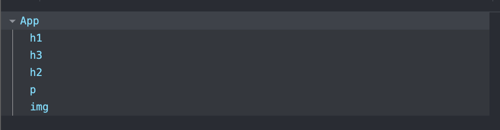

<h1>How to install<h1>

To run the app (Instructions unclear: assuming the task is to explain how to run and install a dev server on VScode)
  Download VScode and Node.js.
    For Node.js, choose the latest lts version, and install npm with it.
  Now download the entire file git directory.

  Open the folder in VScode

  Now, with the folder open, open a new terminal.
    Type -    npm run dev
    This will prompt you with a link to the server which you can copy and paste into your browser of choice.
  
  Enjoy!!

<h1>About the app:<h1>
  
For this complex and modern interactive webapp i used the tools VScode, Node.js, Vite, and React.
    Npm, Vite and React was used to create the backbone of this very complex webapp.
    VScode was used to modify the typescript code, so that i could create this interactive user-experience.

  
  
This is a picture using the chrome extension react developer tools, that shows all the elements in the page as a heirarchical tree.
  

